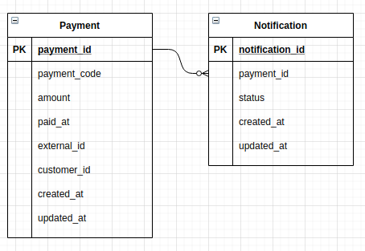

# trial-notification

# Database Schema



# API Definition

**POST /notification**
---
* **Method:**

    `POST`
  
*  **URL Params**
`
    None

*  **URL Query**

    **Required:**

    `callbackURL=[string]`

* **Data Params**
 
    `payment_id=[string]`<br />
    `payment_code=[string]`<br />
    `amount=[integer]`<br />
    `paid_at=[date]`<br />
    `external_id=[string]`<br />
    `customer_id=[string]`<br />


* **Success Response:**

    **Code:** 200 <br />
    **Content:** 
    ```javascript
    { 
      "message": "Notification Delivered"
    }
    ```
 
* **Error Response:**

    **Code:** 404 Not Found <br />
    **Content:**
    ```javascript
    {
      "error": "Callback URL not found"
    }
    ```

    OR

    **Code:** 400 Bad Request <br />
    **Content:**
    ```javascript
    {
      "error": "There is an error with Callback URL"
    }
    ```

    OR

    **Code:** 500 Internal Server Error <br />
    **Content:**
    ```javascript
    {
      "error": "Internal Server Error"
    }
    ```